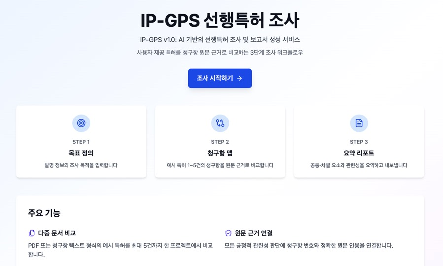
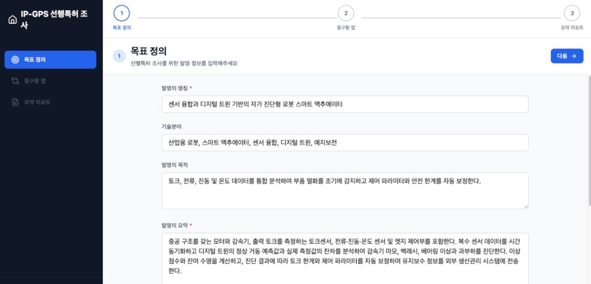
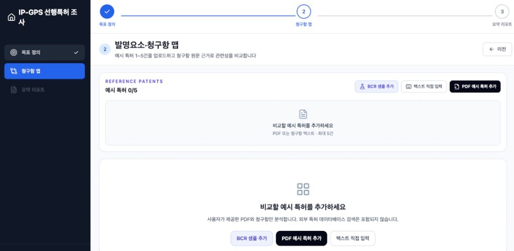

# IP-GPS 선행특허 조사 워크플로우







사용자가 제공한 예시 특허를 청구항 원문 근거로 비교하는 3단계 선행특허 조사 웹 애플리케이션입니다.

## 최근 업데이트 (2026-09-20)

### 주요 내용
- 기본 흐름을 5단계 검색 중심에서 **목표 정의 → 청구항 맵 → 요약 리포트** 3단계로 전환했습니다.
- 예시 특허를 프로젝트당 **1~5건** 업로드하고, 발명요소와 청구항을 원문 근거로 비교합니다.
- KIPRIS 국내 특허·실용신안 상세 인쇄(등록) PDF를 브라우저에서 읽어 서지정보와 청구항을 추출합니다.
- 독립항·종속항·삭제항을 구조화하고, 특허별 관련성 점수와 통합 비교 리포트를 생성합니다.
- PDF 원본은 저장하지 않습니다. 프로젝트 상태는 `localStorage`, 긴 추출 원문은 IndexedDB에만 보관합니다.
- BCR 스마트 액추에이터 샘플 데이터로 흐름을 바로 확인할 수 있습니다.

### 오류 수정
- 청구항 맵의 “PDF를 선택하거나 이곳에 놓으세요” 영역에 **드래그 앤 드롭이 연결되어 있지 않던 문제**를 수정했습니다. 이전에는 파일을 놓아도 앱이 처리하지 않고, 브라우저가 PDF를 직접 여는 경우가 있었습니다.
- KIPRIS 등록 인쇄 PDF의 인용번호·페이지 푸터가 청구항 원문에 섞이지 않도록 파싱을 검증하고, 삼성전자 액추에이터 등록 문서 포함 4건에서 서지정보·청구항 구조화가 동작하는지 확인했습니다.
- 기존 5단계 저장 데이터가 새 3단계 구조에서도 깨지지 않도록 마이그레이션을 유지했습니다.

## 주요 기능

### 1. 목표 정의
- 발명 정보 입력 (명칭, 기술분야, 목적, 요약)
- 조사 목적 명확화

### 2. 발명요소·청구항 맵
- 기준 특허 PDF의 브라우저 내 텍스트 추출 (`pdfjs-dist`)
- 파일 선택 또는 드래그 앤 드롭으로 PDF 첨부
- 프로젝트당 예시 특허 1~5건 비교
- 독립항·종속항·삭제항 구분과 사용자 편집
- 자사 발명요소와 기준 특허 청구항의 원문 근거 연결
- 일치 수준·관련성 검토 및 사용자 확정
- 발명요소 × 특허 비교 매트릭스
- BCR 스마트 액추에이터 샘플 데이터 제공

### 3. 선행특허 리서치 요약 리포트
- 특허별 관련성 점수와 항목별 근거
- 공통 요소·차별 요소·판단 보류 항목
- 발명요소 × 특허 통합 비교표
- 사용자 확정 및 초안 상태 구분
- JSON, Markdown, 인쇄/PDF 내보내기
- 리포트 스냅샷과 갱신 필요 상태

> 새 기본 프로세스에서는 만족도와 정확도가 낮았던 검색 실행·스크리닝 단계를 제외했습니다. 리포트는 사용자 제공 문서만 비교하며 외부 특허 데이터베이스 검색을 포함하지 않습니다.

## 시작하기

### 필수 요구사항
- Node.js 18+
- OpenAI API 키 (레거시 AI 기능 사용 시)

### 설치

```bash
# 의존성 설치
npm install

# 개발 서버 실행
npm run dev

# 로컬 5171 포트로 실행
npm run dev -- --port 5171 --host

# 프로덕션 빌드
npm run build

# 프리뷰
npm run preview
```

### OpenAI API 키 설정

1. [OpenAI Platform](https://platform.openai.com/api-keys)에서 API 키 발급
2. 설정 페이지에서 키 입력
3. 청구항 맵 MVP는 API 키 없이 브라우저 로컬 분석으로 동작

> 기존 GPT 보조 기능은 레거시 클라이언트 호출 방식입니다. 운영 환경에서 활성화할 때는 API 키를 Vercel Functions 등 서버 환경변수로 이전하세요.

## 프로젝트 구조

```
src/
├── components/       # 공통 컴포넌트
│   ├── claim-map/    # PDF 입력, 요소 검토, 청구항 맵, 검색전략 UI
│   ├── ProgressBar.tsx
│   ├── WizardNav.tsx
│   ├── StepHeader.tsx
│   └── TagChips.tsx
├── steps/           # 3단계 기본 페이지 + 레거시 화면
│   ├── Step1.tsx    # 목표 정의
│   ├── Step2.tsx    # 다중 특허 청구항 맵
│   └── Step5.tsx    # 리서치 요약 리포트
├── pages/           # 기타 페이지
│   ├── Home.tsx
│   └── Settings.tsx
├── stores/          # 상태 관리
│   └── useAppStore.ts (Zustand)
├── lib/             # 유틸리티
│   ├── claim-map.ts # 청구항 파싱, 요소 매핑, 검색전략
│   ├── indexed-db.ts # PDF 추출 원문 로컬 저장
│   ├── pdf.ts       # 브라우저 PDF 텍스트 추출
│   ├── pdf-file.ts  # PDF 파일 선택·드롭 헬퍼
│   ├── research-report.ts # 통합 리포트 생성
│   ├── gpt.ts       # GPT API 래퍼
│   ├── search.ts    # 검색 & 유사도
│   └── export.ts    # 내보내기
├── types/           # TypeScript 타입
│   └── index.ts
└── App.tsx          # 라우팅
```

## 보안 및 개인정보

- 청구항 맵 분석은 API 키 없이 브라우저에서 수행
- 기존 GPT 보조 기능은 운영 배포 전 서버 프록시 전환 필요
- 프로젝트 상태는 `localStorage`, 긴 추출 원문은 IndexedDB에 로컬 저장
- PDF 원본은 영구 저장하지 않음
- 새 기본 프로세스는 외부 API 호출이나 스크래핑 없이 동작

## 기술 스택

- **Frontend**: React 18 + TypeScript
- **Build**: Vite
- **Styling**: Tailwind CSS
- **Routing**: React Router v6
- **State**: Zustand + persist
- **PDF**: pdfjs-dist
- **Icons**: Lucide React
- **AI**: OpenAI GPT-4o-mini (레거시 보조 기능)

## 배포

### Vercel (권장)

GitHub `main` 브랜치 푸시 시 Vercel이 자동 배포합니다.

```bash
# Vercel CLI 설치
npm install -g vercel

# 배포
vercel
```

`vercel.json`은 Vite 빌드 결과(`dist`)를 제공하고 SPA 라우팅을 `index.html`로 재작성합니다.

## 문제 해결

### PDF를 놓아도 처리되지 않음
- 청구항 맵 화면의 점선 영역에 PDF를 놓거나 `PDF 예시 특허 추가`로 파일을 선택하세요.
- 스캔 전용 PDF는 텍스트가 없을 수 있습니다. 그 경우 청구항 원문을 직접 붙여넣으세요.

### KIPRIS 등록 인쇄 PDF
- `국내 특허·실용신안 상세 인쇄 화면` 형식이면 명칭, 출원인, 출원·공개·등록번호와 청구항을 자동 추출합니다.
- 권장 크기: 10MB / 50페이지 이하

### 빌드 오류
```bash
rm -rf node_modules package-lock.json
npm install
```

## 면책 조항

본 도구는 참고용이며, 특허 전문가의 검토를 대체할 수 없습니다.
최종 판단은 반드시 전문가와 함께 진행하세요.

## 라이선스

MIT License
