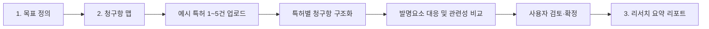

# 다중 예시 특허 비교 및 리서치 요약 리포트 구현계획서

> 대상 시스템: IP-GPS 선행특허 조사 워크플로우  
> 문서 버전: 1.0.0  
> 작성일: 2026-09-20  
> 문서 상태: MVP 구현 완료  
> 핵심 변경: 5단계 검색 중심 흐름을 3단계 근거 중심 흐름으로 전환

---

## 1. 문서 목적

본 문서는 기존 프로세스의 `검색 실행`과 `스크리닝`을 새 기본 흐름에서 제외하고, 사용자가 직접 업로드한 1개 이상의 예시 특허를 조사 대상 발명과 비교한 뒤 근거 중심의 선행특허 리서치 요약 리포트를 생성하는 기능의 구현 계획을 정의한다.

이번 개편의 목표는 검색 결과의 양을 늘리는 것이 아니라 다음 질문에 더 빠르고 정확하게 답하는 것이다.

- 조사 대상 발명의 핵심 구성요소는 무엇인가?
- 업로드한 각 예시 특허의 청구항은 어떤 구성요소를 공개하는가?
- 공통 요소와 차별 요소는 무엇인가?
- 각 비교 판단을 뒷받침하는 정확한 청구항 원문은 무엇인가?
- 사용자가 검토·수정한 결과를 재현 가능한 리포트로 만들 수 있는가?

본 기능은 선행기술 조사와 교육을 보조하며 신규성, 진보성, 침해 또는 등록 가능성에 관한 법률적 결론을 제공하지 않는다.

---

## 2. 배경과 문제 정의

### 2.1 현재 프로세스

1. 목표 정의
2. 청구항 맵
3. 검색 실행
4. 스크리닝
5. 요약 리포트

현재 3단계는 외부 특허 데이터베이스 딥링크와 수동 입력에 의존하고, 4단계는 키워드·IPC·텍스트 유사도 중심으로 후보를 정렬한다. 이 흐름은 다음 문제를 가진다.

- 외부 검색 결과의 품질과 형식이 일정하지 않다.
- 검색 결과를 앱으로 다시 옮기는 과정이 길고 반복적이다.
- 초록·키워드 유사도가 실제 청구항 관련성으로 오인될 수 있다.
- 스크리닝 점수와 원문 근거의 연결이 약하다.
- 사용자가 이미 보유한 핵심 예시 특허를 깊게 비교하려는 목적에 비해 단계가 많다.
- 리포트 생성 전에 사용자가 해야 할 수동 작업이 과도하다.

### 2.2 제품 방향

새 기본 경험은 “넓게 검색하고 많이 추리는 도구”보다 “사용자가 선택한 특허를 깊게 비교하고 설명 가능한 결과를 만드는 도구”에 집중한다.

외부 특허 검색 자체는 제품에서 삭제하지 않는다. 기존 `/step3`, `/step4` 코드는 1차 릴리스에서 보존하되 기본 내비게이션에서는 제외하고, 향후 `고급 조사 모드`로 재도입할 수 있도록 격리한다.

---

## 3. 목표와 비목표

### 3.1 목표

- PDF 또는 청구항 텍스트 형식의 예시 특허를 최소 1건 이상 업로드할 수 있다.
- MVP에서 최대 5건의 예시 특허를 한 프로젝트에서 비교할 수 있다.
- 각 문서의 독립항·종속항·삭제항을 구조화한다.
- 조사 대상 발명요소와 특허별 청구항 요소를 매핑한다.
- 특허별 관련성 점수, 공통 요소, 차별 요소 및 근거 원문을 제공한다.
- 모든 자동 판단을 사용자가 수정하고 확정할 수 있다.
- 확정 데이터로 화면형 리포트와 Markdown·JSON 내보내기를 생성한다.
- 기존 저장 데이터가 깨지지 않도록 마이그레이션한다.
- 데스크톱과 모바일에서 핵심 흐름을 완료할 수 있다.

### 3.2 비목표

- KIPRIS, Google Patents 또는 해외 특허청 자동 검색
- 웹 스크래핑과 후보 특허 자동 수집
- 수십 건 이상의 대규모 특허 일괄 분석
- 도면 OCR 또는 도면 구성 자동 해석
- 특허 등록 가능성, 무효 가능성 또는 비침해에 대한 확정 판단
- 패밀리·인용·피인용 관계의 자동 검증
- 이번 릴리스에서의 사용자 인증·협업·조직 권한관리

---

## 4. 제안 프로세스

### 4.1 새 기본 흐름



### 4.2 단계별 역할

| 단계 | 핵심 작업 | 완료 조건 |
|---|---|---|
| 1. 목표 정의 | 발명 명칭, 기술분야, 목적, 요약 입력 | 명칭과 요약이 존재함 |
| 2. 청구항 맵 | 예시 특허 업로드, 청구항 검토, 발명요소 매핑, 관련성 비교 | 1건 이상의 특허에서 모든 필수 매핑이 사용자 확정됨 |
| 3. 리서치 요약 리포트 | 비교 결과 요약, 특허별 차트, 공통·차별 요소, 추가 조사 과제 확인 및 내보내기 | 리포트 데이터 스냅샷 생성 완료 |

### 4.3 제외되는 기존 단계

- `검색 실행`: 기본 내비게이션, 진행 표시 및 다음 단계 연결에서 제거
- `스크리닝`: 기본 내비게이션, 진행 표시 및 다음 단계 연결에서 제거
- 기존 URL은 즉시 삭제하지 않고 호환용 리다이렉트 또는 고급 모드 진입점으로 유지
- 기존 `priorArtItems`, `selectedItems`, `searchQueries` 데이터는 1차 릴리스에서 읽기 호환을 유지한 뒤 후속 버전에서 제거 여부 결정

---

## 5. 핵심 사용자 시나리오

### 5.1 단일 특허 비교

1. 사용자가 조사 대상 발명을 입력한다.
2. 예시 특허 PDF 1건을 업로드한다.
3. 앱이 PDF 텍스트와 청구항 영역을 추출한다.
4. 사용자가 서지정보, 독립항·종속항 및 청구항 원문을 검토한다.
5. 앱이 발명요소와 청구항 요소의 대응 초안을 생성한다.
6. 사용자가 관련성 수준과 원문 근거를 확인하고 확정한다.
7. 앱이 비교 요약 리포트를 생성한다.

### 5.2 다중 특허 비교

1. 사용자가 첫 번째 특허 분석을 완료한다.
2. `예시 특허 추가`로 최대 4건을 더 업로드한다.
3. 앱이 문서별 분석 상태를 독립적으로 관리한다.
4. 사용자는 특허 탭을 전환하며 청구항과 매핑을 검토한다.
5. 전체 비교 보드에서 발명요소별 공개 여부와 특허별 관련성 점수를 확인한다.
6. 확정된 특허만 포함해 통합 리포트를 생성한다.

### 5.3 추출 실패 처리

1. 스캔 PDF 또는 비정형 PDF에서 청구항을 찾지 못한다.
2. 앱은 오류 원인과 함께 텍스트 직접 입력을 제공한다.
3. 사용자가 `청구항 1`, `청구항 2` 형식으로 원문을 붙여넣는다.
4. 재분석 후 정상 흐름으로 복귀한다.

---

## 6. 정보구조와 화면 설계

### 6.1 전역 내비게이션

```text
목표 정의 → 청구항 맵 → 요약 리포트
```

진행 단계는 숫자 대신 안정적인 키로 관리한다.

```ts
type ProcessStep = 'define' | 'claim-map' | 'report';
```

숫자 기반 `currentStep`은 저장 데이터 호환을 위해 한 번 마이그레이션한 뒤 제거한다.

### 6.2 2단계 청구항 맵 내부 구조

```text
문서 목록
├── 예시 특허 추가
├── 특허 A - 분석 완료
├── 특허 B - 검토 필요
└── 특허 C - 추출 실패

선택된 특허 작업영역
├── 1. 문서 입력
├── 2. 청구항 검토
├── 3. 구성요소 맵
└── 4. 관련성 비교
```

### 6.3 다중 비교 보드

| 자사 발명요소 | 특허 A | 특허 B | 특허 C | 종합 관찰 |
|---|---|---|---|---|
| A1 중공 구동부 | 동일 · 청구항 1 | 부분 · 청구항 3 | 미공개 | 널리 공개된 공통 요소 |
| A2 다중 센서 | 부분 · 청구항 1 | 동일 · 청구항 2 | 부분 · 청구항 5 | 단독 차별성은 낮음 |
| A4 잔여 수명 예측 | 미공개 | 기능 유사 · 청구항 8 | 미공개 | 차별화 후보, 추가 조사 필요 |

모바일에서는 특허 열을 가로 스크롤하지 않고 발명요소별 카드와 특허 선택 필터로 전환한다.

### 6.4 리포트 화면

- 조사 범위와 기준일
- 조사 대상 발명 개요
- 업로드한 예시 특허 목록
- 관련성 요약 매트릭스
- 특허별 청구항 비교표
- 공통 구성요소
- 차별성이 높은 구성요소
- 근거 부족 또는 판단 보류 항목
- 신규성 검토 참고사항
- FTO와 구분된 권리범위 참고사항
- 추가 조사 질문과 추천 검색 개념
- 사용자 수정·확정 이력
- 조사 한계와 전문가 검토 안내

---

## 7. 기능 요구사항

### 7.1 예시 특허 관리

- 최소 1건, 최대 5건의 PDF 또는 청구항 텍스트 입력
- PDF 파일당 권장 10MB, 50페이지 이하
- 동일 파일 해시의 중복 업로드 방지
- 특허명, 출원인, 출원번호, 공개번호, 등록번호 편집
- 문서별 `idle`, `extracting`, `review_required`, `mapping`, `completed`, `failed` 상태
- 문서 삭제 전 확인 및 해당 문서의 청구항·매핑만 제거
- 첫 번째 문서를 삭제해도 나머지 문서 ID와 분석 결과 유지

### 7.2 청구항 구조화

- 독립항, 종속항, 삭제항, 확인 불가 구분
- 종속항의 부모 청구항 표시
- 청구항 번호, 정규화 텍스트, 원문 인용 보존
- 사용자 추가·수정·삭제와 수정 상태 표시
- 원문이 비어 있거나 번호가 중복된 항목의 확정 차단
- 일반 PDF 추출 실패 시 직접 입력 제공

### 7.3 발명요소 관리

- 프로젝트당 공통 발명요소 목록 1개 사용
- 특허가 추가되어도 발명요소 ID는 유지
- 요소 유형, 중요도, 원문 근거 및 검토 상태 편집
- 발명요소 수정 시 영향받는 모든 특허 매핑을 `재검토 필요`로 변경
- 요소 삭제 전 연결된 매핑 수 표시

### 7.4 특허별 관련성 비교

- 발명요소별 대응 청구항 연결
- 동일, 부분 일치, 기능 유사, 차이 있음, 확인 불가 분류
- 청구항 번호와 정확한 원문 인용 필수
- 근거가 없으면 `차이 있음` 또는 `확인 불가`만 허용
- 특허별 관련성 점수와 근거 충족률 표시
- 자동 결과를 사용자가 수정하고 확정
- 확정되지 않은 특허는 최종 리포트에서 `초안`으로 표시

### 7.5 리포트 생성

- 1건 이상의 확정 또는 초안 특허를 선택해 생성
- 화면 리포트, Markdown, JSON 제공
- 브라우저 인쇄를 통한 PDF 저장 지원
- 생성 시점의 데이터 스냅샷과 버전 기록
- 리포트 생성 후 원본 데이터가 바뀌면 `리포트 갱신 필요` 표시
- 점수만 제시하지 않고 모든 핵심 판단에 원문 근거 링크 제공

---

## 8. 관련성 평가 모델

### 8.1 원칙

- 관련성 점수는 조사 우선순위이며 법률적 위험도가 아니다.
- 초록 또는 키워드 일치만으로 높은 점수를 주지 않는다.
- 독립항과 사용자 확정 근거를 가장 크게 반영한다.
- 점수 산식과 각 항목 기여도를 화면에 공개한다.
- 같은 입력과 같은 확정 상태에서는 동일한 점수가 나와야 한다.

### 8.2 권장 산식

| 평가 항목 | 가중치 | 설명 |
|---|---:|---|
| 필수 발명요소 공개 범위 | 40 | 필수 요소가 청구항에 명시·부분·기능적으로 공개되는 정도 |
| 기능·동작 원리 유사성 | 25 | 단순 명칭이 아닌 입력·처리·출력 관계의 유사성 |
| 독립항 근거 비중 | 20 | 대응 근거가 독립항에 포함되는 정도 |
| 원문 근거 품질 | 10 | 인용문 존재, 원문 일치, 사용자 확인 여부 |
| 분석 완결성 | 5 | 미검토·확인 불가 항목이 적은 정도 |

### 8.3 점수 제한 규칙

- 독립항 근거가 하나도 없으면 총점 상한을 59점으로 제한
- 원문 인용이 없는 자동 매핑은 0점 처리
- 미검토 매핑 비율이 30%를 넘으면 점수 대신 `검토 필요` 표시
- 삭제 청구항은 점수 계산에서 제외
- 선택 구성과 기술 효과는 필수 구성보다 낮은 가중치 적용

### 8.4 표시 등급

| 점수 | 표시 | 의미 |
|---:|---|---|
| 80~100 | 관련성 매우 높음 | 다수 필수 요소와 동작 원리가 청구항 근거로 연결됨 |
| 60~79 | 관련성 높음 | 핵심 요소가 상당 부분 연결되나 차별 요소가 존재함 |
| 40~59 | 관련성 중간 | 부분 또는 기능적 유사성이 중심임 |
| 0~39 | 관련성 낮음 | 직접 대응 근거가 제한적임 |
| 산출 불가 | 검토 필요 | 원문 또는 사용자 검토가 부족함 |

`관련성 매우 높음`을 `침해 위험 높음`으로 표현하지 않는다.

---

## 9. 데이터 모델 변경

### 9.1 핵심 변경

현재 `ClaimMapState`는 `document`, `claimElements`, `mappings`가 단일 객체다. 이를 프로젝트 공통 데이터와 특허별 데이터로 분리한다.

```ts
type ResearchProject = {
  id: string;
  processVersion: 2;
  inventionInfo: InventionInfo;
  inventionElements: InventionElement[];
  referencePatents: ReferencePatentAnalysis[];
  activePatentId?: string;
  reportSnapshots: ReportSnapshot[];
  updatedAt: string;
};

type ReferencePatentAnalysis = {
  id: string;
  document: PatentDocument;
  sourceHash: string;
  status: AnalysisStatus;
  claimElements: ClaimElement[];
  mappings: ClaimMapping[];
  relevance?: RelevanceAssessment;
  confirmedAt?: string;
  updatedAt: string;
};

type RelevanceAssessment = {
  score?: number;
  grade: 'very_high' | 'high' | 'medium' | 'low' | 'review_required';
  factorScores: {
    requiredCoverage: number;
    functionalSimilarity: number;
    independentClaimEvidence: number;
    evidenceQuality: number;
    completeness: number;
  };
  commonElementIds: string[];
  distinctiveElementIds: string[];
  unresolvedElementIds: string[];
};

type ReportSnapshot = {
  id: string;
  createdAt: string;
  includedPatentIds: string[];
  sourceVersionHash: string;
  reportData: ResearchReport;
};
```

### 9.2 식별자 규칙

- 프로젝트: `project-{uuid}`
- 특허 문서: `patent-{uuid}`
- 발명요소: 프로젝트 범위의 `A1`, `A2` 유지
- 청구항 요소 내부 키: `{patentId}:C{claimNumber}.{sequence}`
- 매핑: `{patentId}:M:{inventionElementId}`

특허가 추가·삭제되더라도 다른 특허의 ID를 다시 번호 매기지 않는다.

### 9.3 로컬 저장 전략

- Zustand에는 현재 프로젝트의 가벼운 UI 상태와 ID만 저장
- 다중 문서의 추출 텍스트와 분석 결과는 IndexedDB에 저장
- 원본 PDF 바이너리는 기본적으로 저장하지 않음
- `crypto.subtle.digest('SHA-256')`로 파일 해시 생성
- 기존 localStorage `claimMap`은 최초 실행 시 `referencePatents[0]`로 자동 변환
- 마이그레이션 성공 전에는 기존 데이터를 삭제하지 않음

---

## 10. 권장 프런트엔드 구조

```text
src/
├── app/
│   └── processSteps.ts
├── components/
│   ├── reference-patents/
│   │   ├── PatentWorkspace.tsx
│   │   ├── PatentListRail.tsx
│   │   ├── MultiPatentUploader.tsx
│   │   ├── PatentAnalysisStatus.tsx
│   │   └── DeletePatentDialog.tsx
│   ├── claim-map/
│   │   ├── ClaimReviewPanel.tsx
│   │   ├── ClaimMapTable.tsx
│   │   ├── EvidenceDrawer.tsx
│   │   └── MultiPatentComparison.tsx
│   └── report/
│       ├── ResearchReportView.tsx
│       ├── RelevanceSummaryMatrix.tsx
│       ├── PatentClaimChart.tsx
│       └── ReportExportMenu.tsx
├── lib/
│   ├── patent-parser.ts
│   ├── relevance.ts
│   ├── report-builder.ts
│   ├── project-migration.ts
│   └── indexed-db.ts
├── stores/
│   └── useResearchProjectStore.ts
├── types/
│   ├── research-project.ts
│   └── research-report.ts
└── pages/
    ├── DefineInvention.tsx
    ├── ClaimMapWorkspace.tsx
    └── ResearchReport.tsx
```

---

## 11. 라우팅과 이전 버전 호환

### 11.1 새 표준 경로

| 경로 | 화면 |
|---|---|
| `/define` | 목표 정의 |
| `/claim-map` | 예시 특허 업로드·청구항 맵·다중 비교 |
| `/report` | 리서치 요약 리포트 |

### 11.2 기존 경로 처리

| 기존 경로 | 처리 |
|---|---|
| `/step1` | `/define`으로 리다이렉트 |
| `/step2` | `/claim-map`으로 리다이렉트 |
| `/step3` | 기본 모드에서는 `/claim-map`으로 이동하고 안내 배너 표시 |
| `/step4` | 기본 모드에서는 `/claim-map`으로 이동하고 안내 배너 표시 |
| `/step5` | `/report`로 리다이렉트 |

기존 URL을 북마크한 사용자가 빈 화면을 만나지 않도록 최소 2개 릴리스 동안 리다이렉트를 유지한다.

---

## 12. 리포트 데이터와 출력 형식

### 12.1 리포트 구조

리포트 상단에는 `조사 방식: 사용자 제공 문서 비교`와 `외부 특허 데이터베이스 검색 미포함`을 항상 표시한다. 화면 제목은 `선행특허 리서치 요약 리포트`를 사용하되, 업로드 문서 범위를 전체 선행기술 조사 결과로 오인하지 않도록 조사 범위 배지를 함께 노출한다.

1. 조사 개요와 조사 범위
2. 조사 대상 발명
3. 발명 구성요소 목록
4. 업로드한 예시 특허 목록
5. 특허별 관련성 요약
6. 발명요소 × 특허 비교 매트릭스
7. 특허별 독립항·종속항 분석
8. 공통 구성요소
9. 차별성이 높은 구성요소
10. 판단 보류 및 추가 확인 항목
11. 추가 조사 키워드와 IPC 후보
12. 신규성·진보성 검토 참고사항
13. FTO와 구분된 권리범위 참고사항
14. 사용자 수정·확정 이력
15. 조사 한계와 전문가 확인사항

### 12.2 사실과 분석 의견의 구분

리포트의 각 문장은 다음 출처 유형 중 하나를 가진다.

```ts
type StatementSource =
  | { type: 'claim'; patentId: string; claimNumber: number; quote: string }
  | { type: 'invention'; elementId: string; quote: string }
  | { type: 'user'; note: string }
  | { type: 'analysis'; rationale: string };
```

- 청구항 사실: 청구항 번호와 원문 인용 필수
- 사용자 입력: `사용자 확인` 표시
- 자동 분석: `분석 의견` 표시
- 근거 없음: `확인 필요` 표시

### 12.3 내보내기

- Markdown: 사람이 읽고 수정하기 쉬운 전체 리포트
- JSON: 프로젝트, 특허, 매핑, 점수, 근거 및 버전 포함
- 인쇄/PDF: 화면 리포트에 인쇄 전용 스타일 적용
- CSV는 다중 청구항 근거를 평면화하면 정보 손실이 크므로 MVP 기본 출력에서 제외

---

## 13. 정확도와 이용 만족도 개선 지표

### 13.1 정확도 지표

| 지표 | MVP 목표 |
|---|---:|
| KIPRIS 텍스트 PDF 청구항 번호 인식률 | 95% 이상 |
| 독립항·종속항·삭제항 분류 정확도 | 95% 이상 |
| 표시된 원문 인용의 실제 원문 일치율 | 100% |
| 필수 근거가 없는 자동 확정 건수 | 0건 |
| 동일 입력의 관련성 점수 재현율 | 100% |
| 기준 데이터셋에서 전문가 매핑과의 정밀도 | 90% 이상 |

### 13.2 만족도 지표

| 지표 | 목표 |
|---|---:|
| 목표 정의 시작 대비 리포트 생성 완료율 | 70% 이상 |
| 단일 특허 업로드부터 리포트 생성까지 중앙시간 | 10분 이하 |
| 검색 실행·스크리닝 단계 이탈률 | 새 흐름에서 해당 없음 |
| 자동 매핑의 사용자 수정률 | 초기 30% 이하, 반복 개선 |
| 원문 근거 열람 후 확정 비율 | 80% 이상 |
| 완료 후 5점 만족도 | 평균 4.2 이상 |

분석 품질 지표는 사용자 행동 로그만으로 판단하지 않고 전문가 검토용 기준 데이터셋과 함께 평가한다.

---

## 14. 구현 단계

### Phase 0 - 기준선과 데이터 마이그레이션

- 현재 5단계 완료율과 단계별 이탈률 기록 방법 정의
- `processVersion: 2` 데이터 모델 추가
- 단일 `claimMap.document`를 `referencePatents[0]`으로 변환하는 마이그레이션 작성
- 마이그레이션 실패 시 기존 데이터 보존과 복구 UI 제공
- 관련성 점수 기준 데이터셋 10~20건 준비

완료 기준: 기존 BCR 샘플 프로젝트가 데이터 손실 없이 새 모델로 열림.

### Phase 1 - 3단계 프로세스 전환

- 진행 단계 정의를 `processSteps.ts`로 중앙화
- `WizardNav`, `ProgressBar`, `StepHeader`를 단계 키 기반으로 변경
- `/define`, `/claim-map`, `/report` 라우트 추가
- 기존 `/step1`~`/step5` 호환 리다이렉트 추가
- 목표 정의의 다음 경로를 `/claim-map`으로 변경

완료 기준: 새 프로젝트가 검색 실행과 스크리닝을 거치지 않고 리포트까지 이동함.

### Phase 2 - 다중 예시 특허 업로드

- `ReferencePatentAnalysis[]` 상태와 액션 구현
- 다중 PDF 선택 및 순차 추출
- 문서 목록, 상태, 활성 문서 전환 UI 구현
- 파일 해시 중복 확인
- 문서별 직접 입력과 재시도
- 문서 삭제와 관련 데이터 정리

완료 기준: PDF 1~5건을 추가하고 각 문서의 청구항을 독립적으로 편집할 수 있음.

### Phase 3 - 특허별 맵과 관련성 평가

- 공통 발명요소와 특허별 청구항 매핑 구조로 전환
- 관련성 평가 순수 함수 구현
- 독립항 근거, 근거 품질 및 미검토 상한 규칙 적용
- 특허별 요약 카드와 다중 비교 보드 구현
- 발명요소 변경 시 관련 특허 재검토 상태 전파

완료 기준: 각 특허의 점수와 등급이 계산되고 모든 기여 항목과 원문 근거를 확인할 수 있음.

### Phase 4 - 리서치 요약 리포트

- `ResearchReport` 스키마와 리포트 빌더 구현
- 화면 리포트와 다중 비교 매트릭스 구현
- Markdown·JSON 내보내기 확장
- 인쇄 전용 CSS와 페이지 나눔 적용
- 리포트 스냅샷과 갱신 필요 상태 구현

완료 기준: 선택한 1~5건의 특허가 하나의 근거 중심 리포트로 생성·내보내기됨.

### Phase 5 - 품질·접근성·성능

- 키보드 탐색과 스크린리더 레이블 점검
- 모바일 카드 레이아웃 구현
- 5개 PDF 추출 중 취소·재시도 처리
- 대용량 텍스트의 IndexedDB 저장과 지연 로딩
- 기준 데이터셋 자동 회귀 테스트
- 이용 만족도 마이크로 설문 추가

완료 기준: 인수 조건과 성능·접근성 테스트를 모두 통과함.

---

## 15. 파일별 변경 계획

| 파일/영역 | 변경 내용 |
|---|---|
| `src/App.tsx` | 3단계 표준 라우트와 기존 경로 리다이렉트 |
| `src/components/WizardNav.tsx` | 검색 실행·스크리닝 제거, 단계 키 기반 접근 제어 |
| `src/components/ProgressBar.tsx` | 3단계 표시와 반응형 처리 |
| `src/steps/Step1.tsx` | 다음 경로 변경, 프로젝트 초기화 규칙 |
| `src/steps/Step2.tsx` | 다중 특허 작업공간 컨테이너로 분리 |
| `src/steps/Step5.tsx` | 독립 리포트 페이지로 재구성 |
| `src/stores/useAppStore.ts` | 프로젝트 저장소로 마이그레이션 또는 호환 어댑터 추가 |
| `src/types/claim-map.ts` | 단일 문서 구조를 특허별 분석 구조로 확장 |
| `src/lib/claim-map.ts` | 문서 독립 파싱과 매핑 함수로 분리 |
| `src/lib/export.ts` | 다중 특허 리포트 Markdown·JSON 출력 |
| `src/steps/Step3.tsx` | 기본 라우팅에서 제외, 고급 모드 보존 |
| `src/steps/Step4.tsx` | 기본 라우팅에서 제외, 레거시 데이터 호환만 유지 |
| `tests/browser-check.mjs` | 3단계 E2E와 다중 PDF 시나리오 추가 |

---

## 16. 테스트 계획

### 16.1 단위 테스트

- 여러 형식의 청구항 번호 파싱
- 독립항·종속항·삭제항 구분
- 부모 청구항 추출
- 파일 SHA-256 중복 판단
- 특허별 복합 ID 생성과 충돌 방지
- 관련성 점수 각 가중치 계산
- 독립항 근거가 없을 때 59점 상한 적용
- 근거 없는 매핑의 점수 제외
- 발명요소 수정 시 관련 매핑 재검토 전파
- 리포트 스냅샷 해시 비교
- 버전 1 → 버전 2 상태 마이그레이션

### 16.2 통합 테스트

- PDF 추출 → 청구항 편집 → 매핑 → 확정 → 리포트
- 특허 3건의 상태와 매핑이 서로 섞이지 않음
- 특허 1건 삭제 후 다른 특허 데이터 유지
- 동일 PDF 재업로드 차단
- 리포트 생성 후 매핑 수정 시 갱신 필요 표시
- Markdown과 JSON의 원문 근거 일치

### 16.3 E2E 테스트

1. 조사 대상 발명 입력
2. KIPRIS 예시 PDF 업로드
3. 두 번째 예시 특허 텍스트 입력
4. 각 특허의 청구항 구조 확인
5. 공통 발명요소와 특허별 매핑 생성
6. 원문 근거 드로어 확인
7. 일부 매핑 수정과 확정
8. 다중 비교 보드 확인
9. 리포트 생성
10. Markdown·JSON 내보내기
11. 새로고침 후 프로젝트 복원
12. 모바일 화면에서 동일 흐름 완료

---

## 17. 인수 조건

- [ ] 사용자가 PDF 또는 청구항 텍스트 형태의 예시 특허를 1~5건 입력할 수 있음
- [ ] 각 특허의 분석 상태와 오류가 독립적으로 관리됨
- [ ] 특허별 독립항·종속항·삭제항이 구분되어 표시됨
- [ ] 공통 발명요소와 각 특허의 청구항 요소가 연결됨
- [ ] 모든 긍정적 관련성 판단에 청구항 번호와 원문 근거가 존재함
- [ ] 근거가 없는 판단은 자동 확정되지 않음
- [ ] 특허별 관련성 점수의 항목별 기여도를 볼 수 있음
- [ ] 관련성 점수가 법률적 위험도와 구분되어 표시됨
- [ ] 사용자가 매핑을 수정하고 특허별로 확정할 수 있음
- [ ] 여러 특허를 발명요소 기준으로 한 화면에서 비교할 수 있음
- [ ] 확정 또는 초안 특허 1건 이상으로 리포트를 생성할 수 있음
- [ ] 리포트에 공통 요소, 차별 요소, 보류 항목 및 추가 조사 과제가 포함됨
- [ ] Markdown·JSON·인쇄 출력에 근거 원문과 사용자 확정 상태가 포함됨
- [ ] 기본 내비게이션에서 검색 실행과 스크리닝이 제거됨
- [ ] 기존 프로젝트가 데이터 손실 없이 새 구조로 마이그레이션됨
- [ ] 데스크톱과 모바일에서 핵심 작업을 완료할 수 있음
- [ ] 빌드, 린트, 단위 테스트 및 E2E 테스트가 통과함

---

## 18. 위험과 대응

| 위험 | 영향 | 대응 |
|---|---|---|
| 다양한 PDF 형식으로 청구항 추출 실패 | 분석 시작 불가 | 직접 입력, 범위 편집, 테스트 문서 확대 |
| 다중 문서 텍스트로 localStorage 용량 초과 | 저장 실패 | IndexedDB 전환, PDF 원본 미저장 |
| 관련성 점수를 법률 위험으로 오해 | 잘못된 의사결정 | 용어 분리, 산식 공개, 면책과 전문가 확인 표시 |
| 발명요소 수정 후 과거 매핑이 남음 | 결과 불일치 | 영향 매핑을 자동으로 재검토 상태로 전환 |
| 자동 매핑이 근거 없이 그럴듯한 결과 생성 | 정확도 저하 | 인용 일치 검증, 근거 없는 매핑 자동 확정 금지 |
| 5개 문서 비교 화면의 정보 과밀 | 사용성 저하 | 문서 레일, 필터, 요약 매트릭스, 모바일 카드 |
| 기존 사용자 저장 데이터 손실 | 신뢰 저하 | 버전 마이그레이션, 원본 백업, 실패 시 롤백 |
| 검색 기능 제거로 광범위 조사 요구 미충족 | 기능 공백 | 레거시 코드를 고급 조사 모드로 보존 |

---

## 19. 구현 우선순위와 예상 작업량

| 우선순위 | 작업 | 예상 규모 |
|---|---|---:|
| P0 | 3단계 내비게이션과 라우팅 전환 | 1~2일 |
| P0 | 다중 특허 데이터 모델과 마이그레이션 | 2~3일 |
| P0 | 다중 업로드·문서 전환·삭제 | 2~3일 |
| P0 | 특허별 청구항 맵 분리 | 2~3일 |
| P0 | 관련성 평가와 근거 제한 규칙 | 2일 |
| P0 | 다중 비교 보드 | 2~3일 |
| P0 | 통합 리포트와 Markdown·JSON 출력 | 2~3일 |
| P1 | IndexedDB 저장과 복구 | 2일 |
| P1 | 인쇄/PDF 스타일 | 1~2일 |
| P1 | 모바일·접근성 개선 | 2일 |
| P1 | 기준 데이터셋과 회귀 테스트 | 2~3일 |

단일 개발자 기준 MVP는 약 3~4주를 예상한다. 기존 청구항 맵 컴포넌트를 재사용하면 UI 구현 기간을 단축할 수 있다.

---

## 20. 출시 전략

### 20.1 내부 검증

- BCR 기준 특허와 추가 예시 특허 2~3건으로 반복 테스트
- 특허 전문가가 발명요소, 대응 청구항 및 관련성 등급 검토
- 점수보다 근거 정확도를 우선해 오류 수정

### 20.2 제한 공개

- 새 3단계 흐름을 기본값으로 제공
- 기존 검색·스크리닝은 설정의 `고급 조사 모드`에서만 제공
- 완료율, 소요시간, 수정률 및 만족도 수집

### 20.3 정식 전환

- 정확도·만족도 목표 충족 후 3단계 흐름을 정식 프로세스로 확정
- 레거시 단계 사용률이 낮고 대체 요구가 없을 때 별도 제거 계획 수립
- 서버 기반 AI 및 프로젝트 저장은 데이터 기밀성 정책 확정 후 도입

---

## 21. 구현 전 확정할 결정

| 결정 항목 | 권장안 | 확정 시점 |
|---|---|---|
| MVP 최대 특허 수 | 5건 | Phase 0 |
| 새 프로세스 기본 여부 | 기본값 | Phase 0 |
| 기존 검색·스크리닝 처리 | 고급 모드로 보존 | Phase 1 |
| 저장소 | IndexedDB + Zustand UI 상태 | Phase 0 |
| 관련성 점수 명칭 | `청구항 관련성` | Phase 3 |
| PDF 원본 저장 | 저장하지 않음 | Phase 2 |
| 리포트 기본 출력 | 화면 + Markdown + JSON + 인쇄 | Phase 4 |
| 미확정 특허 포함 | 가능, `초안` 표시 | Phase 4 |
| 서버 AI 도입 | 후속 릴리스 | MVP 이후 |

---

## 22. 완료 정의

이번 개편은 단순히 3·4단계를 숨기는 작업이 아니다. 다음 세 조건을 모두 만족할 때 완료로 본다.

1. 사용자가 예시 특허를 직접 제공하고 원문 근거를 검토하는 흐름이 기존 검색·스크리닝을 완전히 대체한다.
2. 특허가 여러 건이어도 각 판단의 출처, 사용자 수정 여부 및 관련성 산식이 추적 가능하다.
3. 최종 리포트만 읽어도 조사 범위, 공통 요소, 차별 요소, 판단 보류 사항과 추가 조사 필요성을 이해할 수 있다.

이 구조는 현재 청구항 맵 기능의 만족도를 유지하면서 낮은 만족도의 검색·스크리닝 단계를 제거하고, 제품의 중심을 “검색량”에서 “근거가 연결된 비교 품질”로 이동시킨다.

---

## 23. 구현 결과 기록

2026-09-20 기준 다음 MVP 범위를 구현했다.

- `/define → /claim-map → /report` 3단계 기본 라우팅
- 기존 `/step1`~`/step5` 호환 리다이렉트
- PDF 또는 청구항 텍스트 방식의 예시 특허 최대 5건 관리
- 파일 SHA-256 중복 확인과 긴 추출 원문의 IndexedDB 분리 저장
- 프로젝트 공통 발명요소와 특허별 청구항·매핑 상태 분리
- BCR 문서 전용 검증 규칙과 일반 문서의 원문 기술표현 기반 매핑 분리
- 필수 요소·기능 원리·독립항·근거 품질·검토 완결성 기반 관련성 평가
- 독립항 근거가 없는 점수의 59점 상한과 미검토 결과의 점수 비표시
- 다중 특허 비교 매트릭스와 특허별 근거 드로어
- 사용자 제공 문서 범위를 명시하는 통합 리포트
- Markdown·JSON·인쇄 내보내기와 리포트 스냅샷
- 기존 단일 `claimMap` 저장 데이터의 버전 2 자동 마이그레이션
- 데스크톱 사이드 내비게이션과 모바일 상단 내비게이션
- 브라우저 로컬 만족도 1~5점 기록
- 실제 PDF 1건과 텍스트 특허 1건을 이용한 E2E 및 마이그레이션 회귀 테스트

서버 기반 AI, 조직 단위 분석 이력, 전문가 기준 데이터셋의 정량 평가는 후속 릴리스 범위로 유지한다.
